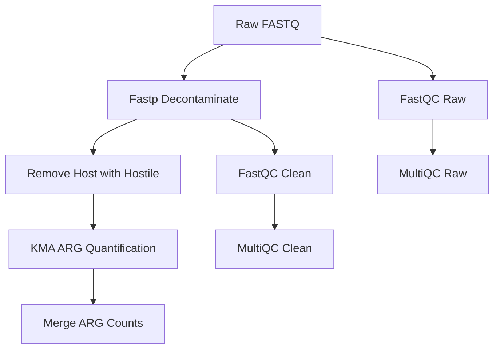

# ARG Analysis Pipeline

This is a Nextflow-based metagenomics pipeline designed to identify and quantify Antimicrobial Resistance Genes (ARGs) from paired-end sequencing data. This workflow integrates quality control, host decontamination, and K-mer-based alignment against the ResFinder database to produce length-normalized (TPM) abundance matrices.

## Table of Contents

- [Pipeline Overview](#pipeline-overview)
- [Key Features](#key-features)
- [Prerequisites](#prerequisites)
- [Installation](#installation)
- [Input Files](#input-files)
- [Configuration & Parameters](#configuration--parameters)
- [Quick Start](#quick-start)
- [Outputs](#outputs)
- [Core Processes](#core-processes)
- [Troubleshooting](#troubleshooting)
- [License](#license)
- [Contributing](#contributing)
- [Contact](#contact)

## Pipeline Overview

The pipeline executes the following stages:

1. **Raw Quality Control**: Initial assessment of raw reads using **FastQC**.
2. **Preprocessing & Decontamination**:
   - **Fastp**: Trimming of adapters and low-quality bases.
   - **Hostile**: Removal of human/host DNA using Bowtie2 alignment against a reference genome.
3. **Clean Quality Control**: Post-processing QC and aggregation of reports via **MultiQC**.
4. **ARG Quantification**:
   - **KMA (K-mer Alignment)**: Mapping clean microbial reads against the ResFinder database.
   - Strict assignment (`-1t1`) is used to prevent double-counting across homologous alleles.
5. **Matrix Generation**: A custom Python/Pandas script aggregates individual sample results into master matrices.



## Key Features

- **Normalization**: Calculates **Transcripts Per Million (TPM)** based on KMA's `Depth` metric, accounting for both gene length and sequencing depth.
- **Safety & Reliability**:
  - Uses `.unique()` on sample IDs to prevent duplicate processing of merged FASTQ files.
  - Employs **Singularity/Docker** containers for software reproducibility (Fastp, Hostile, Pandas).
- **Outputs**: Produces both **Raw Depth** and **TPM** matrices in tab-separated format.

## Prerequisites

### Software Dependencies
- [Nextflow](https://www.nextflow.io/) (version 21.0+)
- [FastQC](https://www.bioinformatics.babraham.ac.uk/projects/fastqc/) (version 0.11.9+)
- [fastp](https://github.com/OpenGene/fastp) (version 0.23.1+)
- [MultiQC](https://multiqc.info/) (version 1.12+)
- [Hostile](https://github.com/bede/hostile) (version 1.0+)
- [KMA](https://bitbucket.org/genomicepidemiology/kma/src/master/) (version 1.4.0+)
- [SAMtools](http://www.htslib.org/) (version 1.9+)
- Python 3.8+ with [pandas](https://pandas.pydata.org/) (version 1.4.3+)

### Databases
- **ResFinder database**: Download from [ResFinder DB](https://bitbucket.org/genomicepidemiology/resfinder_db/src/master/) and index with KMA.
- **MetaPhlAn database**: Download from [MetaPhlAn](https://github.com/biobakery/MetaPhlAn) (if needed for future extensions).

### System Requirements
- Linux/macOS
- 8+ CPUs, 64GB+ RAM (recommended for KMA process)
- Singularity or Docker for containerized processes

## Installation

1. Clone the repository:
   ```bash
   git clone https://github.com/EdgarsLiepa/AMR_analysis.git
   cd AMR_analysis
   ```

2. Install Nextflow:
   ```bash
   curl -s https://get.nextflow.io | bash
   mv nextflow ~/bin/  # or add to PATH
   ```

3. Install dependencies (using conda as example):
   ```bash
   conda create -n amr_env python=3.9
   conda activate amr_env
   conda install -c bioconda fastqc fastp multiqc hostile kma samtools
   conda install pandas
   ```

4. Download and prepare databases:
   - ResFinder: Download and index as per [KMA documentation](https://bitbucket.org/genomicepidemiology/kma/src/master/).
   - Place databases in `DB/` directory.

## Input Files

- **Samplesheet**: TSV file with header `sample_id` (e.g., `sample1`). Example:
  ```
  sample_id
  LM0563
  LM0564
  ```
- **Reads Directory**: Contains paired FASTQ files named `{sample_id}_R1.fastq.gz` and `{sample_id}_R2.fastq.gz`.

## Configuration & Parameters

Parameters can be set in the `workflow/countARGs.nf` file or overridden via command line:

| Parameter | Description | Default |
| --- | --- | --- |
| `params.samplesheet` | Path to samplesheet TSV | `${params.projPath}/data/202x-xx-xx/samplesheet_202x-xx-xx.tsv` |
| `params.reads_dir` | Directory with FASTQ files | `${params.projPath}/data/202x-xx-xx/merged_reads` |
| `params.resfinder_db` | Path to ResFinder DB prefix | `DB/resfinder_db/all` |
| `params.metaphlan_db` | Path to MetaPhlAn DB | `DB/metaphlan_db` |
| `params.outdir` | Output directory | `${params.projPath}/results/202x-xx-xx` |
| `params.qualified_quality_phred` | Fastp quality threshold | 20 |
| `params.unqualified_percent_limit` | Fastp unqualified limit | 40 |
| `params.min_length` | Fastp min read length | 50 |

## Quick Start

1. Prepare environment and inputs as above.
2. Run the pipeline:
   ```bash
   nextflow run workflow/countARGs.nf \
     --samplesheet path/to/samples.tsv \
     --reads_dir path/to/fastq_dir \
     --resfinder_db path/to/db/all \
     --outdir results/my_run
   ```
3. For containerized run:
   ```bash
   nextflow run workflow/countARGs.nf -profile docker
   ```

## Outputs

Results are in the specified `outdir`:

- `multiqc_raw/`: MultiQC report for raw reads.
- `multiqc_clean/`: MultiQC report for cleaned reads (includes fastp JSON).
- `host_removed/`: Host-filtered FASTQ files.
- `KMA/`: Per-sample KMA results (`.res` files) and ARG counts TSVs.
- `Final_Results/`:
  - `Master_ARG_RawDepth_Matrix.tsv`: Raw depth values per gene/sample.
  - `Master_ARG_TPM_Matrix.tsv`: TPM-normalized abundances.

## Core Processes

### ARG Quantification (`ARG_KMA`)
- Uses KMA with `-1t1` (strict assignment), `-nc` (no consensus), optimizing for speed/memory.
- Extracts Gene, Template_Length, Template_Coverage, Depth.
- Resources: 8 CPUs, 64GB RAM, 1 day.

### Matrix Merging (`MERGE_ARG_COUNTS`)
- Python script performs outer join on count files.
- TPM = (Gene Depth / Total Sample Depth) × 1,000,000.
- Resources: 1 CPU, 8GB RAM.

## Troubleshooting

- **Database errors**: Ensure ResFinder DB is indexed and paths are correct.
- **Memory issues**: Increase RAM allocation for KMA or reduce batch size.
- **File not found**: Verify samplesheet format and FASTQ naming.
- **Resume runs**: Use `nextflow run -resume` for partial reruns.
- **Container issues**: Check Singularity/Docker installation.

## License

[Specify your license, e.g., MIT]

## Contributing

Contributions welcome! Please submit issues/PRs on GitHub.

## Contact

Edgars Liepa - [Your email/contact]
